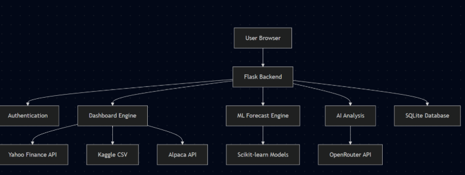
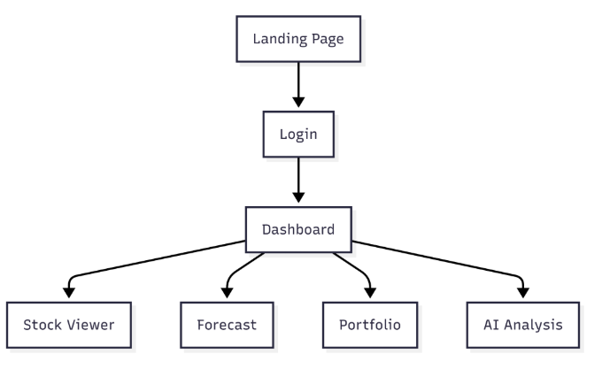

# System Blueprint

**TNPG**: financebros
**Project**: Blossomberg Terminal
**Target ship date**: 2026-06-01

---

#### Roster:

| Name | Email | Primary Role | Secondary Role |
|---|---|---|---|
| Haowen Xiao | haowenx2@nycstudents.net | Frontend, UI, charts, deployment, page-layout | Project Manager, team coordination, deadlines |
| Cody Wong | codyw2789@nycstudents.net | Database, API integration | Stock datasets, backend |
| Robert Chen | robertc295@nycstudents.net | Backend, Flask app, routing, request handling | Authentication, portfolio pages, user accounts |
| James Sun | jamess9845@nycstudents.net | Machine learning forecast, AI analysis | LLM integration, Review |

---

# Summary

Blossomberg terminal is a simpled-down and modernized clone of the Bloomberg Terminal that uses live stock data, charts, and ML forecasting with an AI analysis layer for market exploration and learning

## Problem Being Solved

The real Bloomberg Terminal costs almost $25,000 / year and has a UI that was built in 1980s that is very intimidating for beginners. Retail traders and students who want to learn can use this to learn more about stocks and other features of the stock market before deciding if they need a full Bloomberg terminal.

## Target Users

Who will use this system?

- Stock traders
- Aspiring Students learning finance
- Retail / hobby investors ("finance bros")

## Why This Project Matters

This project matters because Bloomberg can be both very overwhelming and expensive to a normal user or someone who wants to get into this type of learning. We hope that this project can help students learn but also for professionals to use for their day to day lives.

---

# Minimum Viable Product (MVP) Scope

## Core Features (Required for Final Submission)
Features that **must** be completed:
- Stock data pulling live and historical prices from Yahoo Finance API or cached in SQLite
- Dashboard with searchable stock tickers, growth charts, comparison graphs, and volume charts using Chart.js
- ML forecast page using Scikit-learn regression models trained on the FAANG historical dataset and yfinance. Predicts graphs and has confidence intervals
- Portfolio / watchlist system letting users save tickers to their account and view their performance
- AI Analysis panel using OpenRouter that answers questions like "Why did NVDA rise today?"
- Stock viewer page (/stockviewer): table of top 15 stocks showing live price, change %, open, high, low, volume, and 30-day charts
- Stock detail page: Gives all important data about a specific stock such as their valuation, financials, dividends, analyst ratings, etc with a extended graph and Sharpe ratio comparison.
- Simulated portfolio with paper trading: start with $100,000 cash and buy/sell semi-live yfinance prices with transaction history and portfolio reset

## Stretch Features (Only if MVP is Complete)
- Candlestick and line graphs
- Sector and index heatmap
- Email/alert system for prices

## Explicit Non-Goals

- Personally learn more about the FinTech industry
- Learn more about stocks and equations used

### Features intentionally excluded:
- Real-money trading or integration of any kind
- Tick-by-tick streaming data
- Options, futures, crypto, forex

---

# Technology Stack

| Layer | Selected Tool |
|---|---|
| Backend Framework | Flask |
| Frontend Framework | TailwindCSS, JavaScript |
| Database | SQLite |
| Authentication | Flask sessions |
| ORM / DB Library | N/A |
| Data Visualization | Chart.js |
| Machine Learning | Sci-kit-Learn |
| Market Data | yFinance |
| AI | OpenRouter API|

## Why This Stack Was Chosen

Flask is what everyone has been using since day 1; it works well and fits our needs since we’re mostly serving cached data and proxying API calls instead of handling a lot of backend logic. SQLite is because our dataset fits in a single file and we don’t expect many users writing to the database at the time of MVP. We decided to go with TailwindCSS because it is the most customizable and easiest to work with for building a dashboard, and Chart.js is the best option for our needs for graphs, comparisons, and volume visualizations for equities as if we finish the MVP. OpenRouter was chosen for the AI layer because it gives us access to multiple LLM providers without separate billing, and the student pack credits make it free for this project.

---

# Team Ownership Plan

| Team Member | Primary Ownership | Secondary Ownership | Specific Deliverables |
|---|---|---|---|
| Haowen Xiao | Frontend, UI Infrastructure | Project Management, Deployment | Build dashboard UI, implement navigation/layout, integrate charts, and manage deployment setup |
| Cody Wong | SQLite, API integration | Stock datasets, backend | Set up SQLite database, integrate stock APIs, cache historical data, and manage backend data flow |
| Robert Chen | Flask, routing, sessions | Authentification, Portfolio pages | Build Flask routes, manage user sessions/login system, and develop portfolio/watchlist pages |
| James Sun | ML forecasting system, AI integration | Flask backend support, analytics features | Train and evaluate Sk-learn models using stock data from yFinance, packaging model weights and integrating into Flask app to create prediction-vs-actual comparison charts. |

---

# Component map

# Site map

## Key User Stories

### Day-trading retail investor
As a retail investor actively trading during market hours, I want to pull up a ticker, see its growth and make a decision.  I want real-time price updates, technical indicators, and AI-generated summaries with verified news sources so that I can react quickly to market movements and make fast trading decisions.

### Aspiring finance student
As a finance student learning how markets work, I want to compare equities side by side and view prediction models with confidence intervals and historical trend explanations so that I can better understand how market behavior and forecasting models operate before investing real money.

### Hobbyist with a watchlist
As a casual investor managing a personal watchlist, I want to save and organize my favorite tickers and monitor their long-term performance in one dashboard so that I can conveniently track my investments without using multiple platforms.
---

# Database Design

| Table Name | Purpose |
|---|---|
| `users` | Stores user account information for login and sessions |
| `watchlist` | Stores the stock tickers each user saves |
| `stock_cache` | Stores cached stock price data pulled from yFinance |
| `portfolio` | Stores simulated user holdings for tracked stocks |
| `ai_queries` | Stores recent AI analysis questions and answers |
| `ml_predictions` | Stores ML forecast results for selected stocks |

### USERS

| Type | Field | Description |
|---|---|---|
| INTEGER PRIMARY KEY | id | Unique user ID |
| TEXT UNIQUE | username | User login name |
| TEXT UNIQUE | password | User password |

### WATCHLIST

| Type | Field | Description |
|---|---|---|
| INTEGER PRIMARY KEY | ID | Unique watchlist item id |
| INTEGER | User_id | Links to user id |
| TEXT | Ticker | Saved stock ticker |

### stock_cache

| Type | Field | Description |
|---|---|---|
| INTEGER PRIMARY KEY | id | Unique stock data row |
| TEXT | ticker | Stock ticker symbol |
| DATE | date | Trading date |
| REAL | open | Opening price |
| REAL | high | Highest price |
| REAL | low | Lowest price |
| REAL | close | Closing price |
| INTEGER | volume | Trading volume |

### Portfolio

| TYPE | FIELD | DESCRIPTION |
|---|---|---|
| INTEGER PRIMARY KEY | id | Unique portfolio entry |
| INTEGER | user_id | Links to users.id |
| TEXT | ticker | Stock ticker owned |
| REAL | shares | Number of shares |
| REAL | avg_price | Average purchase price |
| DATETIME | created_at | Time holding was added |

### AI_QUERIES

| TYPE | FIELD | DESCRIPTION |
|---|---|---|
| INTEGER PRIMARY KEY | id | Unique AI query ID |
| INTEGER | user_id | Links to user.id |
| TEXT | ticker | Related stock ticker |
| TEXT | question | User's question |
| TEXT | answer | ai -generated response |
| DATETIME | created_at | TIme question was asked |

### ML_predictions

| TYPE | FIELD | DESCRIPTION |
|---|---|---|
| INTEGER PRIMARY KEY | ID | Unique prediction ID |
| TEXT | ticker | Stock ticker |
| DATE | prediction_date | Date prediction was made |
| DATE | target_date | Date was being predicted |
| REAL | predicted_price | ML-predicted stock price |

### paper_balance

| TYPE | FIELD | DESCRIPTION |
|---|---|---|
| INTEGER PRIMARY KEY | user_id | Links to users.id |
| REAL | cash | Current cash balance (default $100,000) |

### paper_holdings

| TYPE | FIELD | DESCRIPTION |
|---|---|---|
| INTEGER PRIMARY KEY | id | Unique holding ID |
| INTEGER | user_id | Links to users.id |
| TEXT | ticker | Stock ticker |
| REAL | shares | Shares currently held |
| REAL | avg_cost | Weighted average purchase price |

### paper_transactions

| TYPE | FIELD | DESCRIPTION |
|---|---|---|
| INTEGER PRIMARY KEY | id | Unique transaction ID |
| INTEGER | user_id | Links to users.id |
| TEXT | ticker | Stock ticker |
| TEXT | action | BUY or SELL |
| REAL | shares | Shares traded |
| REAL | price | Price per share at execution |
| REAL | total | Total dollar value |
| DATETIME | created_at | Timestamp of trade (UTC for now) |

---

# Testing Plan

**Stock Data API**
- What to Test: Ticker search, live prices, historical prices
- Testing Method: Test with common tickers like AAPL, NVDA, TSLA, and invalid tickers
- Success Criteria: Correct data loads without crashing, invalid tickers show an error message

**SQLite Database**
- What to Test: Users, watchlists, cached stock data, predictions
- Testing Method: Add, update, delete, and retrieve sample records
- Success Criteria: Data saves correctly and can be retrieved after refreshing

**Flask Routes**
- What to Test: Page routing and backend API endpoints
- Testing Method: Manually visit each route and test API responses
- Success Criteria: All routes load correctly and return expected data

**Authentication**
- What to Test: Login, logout, user sessions
- Testing Method: Create test accounts and try valid/invalid logins
- Success Criteria: Users stay logged in correctly and cannot access private pages when logged out

**Dashboard UI**
- What to Test: Layout, stock search, charts, responsiveness
- Testing Method: Test on desktop and smaller browser widths
- Success Criteria: UI is readable, organized, and does not break on resize

**Chart.js Visualizations**
- What to Test: Price charts, comparison graphs, volume charts
- Testing Method: Compare displayed chart data with backend data
- Success Criteria: Charts match the correct ticker data and update when users search

**Watchlist / Portfolio**
- What to Test: Save tickers, remove tickers, view performance
- Testing Method: Add and remove sample tickers from a test account
- Success Criteria: Saved tickers stay attached to the correct user

**ML Forecasting**
- What to Test: Prediction output, prediction-vs-actual chart
- Testing Method: Run model on historical yFinance data and compare output format
- Success Criteria: Forecast loads, graph displays correctly, and model does not crash

**AI Analysis Panel**
- What to Test: User questions and AI stock explanations
- Testing Method: Ask sample questions like "Why did NVDA rise today?"
- Success Criteria: AI returns relevant explanations and handles missing data gracefully

**Error Handling**
- What to Test: Invalid inputs, API failures, empty results
- Testing Method: Test fake tickers, bad login info, and disconnected API cases
- Success Criteria: App shows clear error messages instead of crashing

**Final Integration**
- What to Test: Full user flow across the app
- Testing Method: Login, search stock, view chart, save watchlist, run forecast, ask AI question
- Success Criteria: Full workflow works smoothly from start to finish

---

# Timeline

## Week 1 Goals:
- Create GitHub repository and organize overall project structure
- Set up Flask backend framework and routing system
- Create SQLite database tables and schema
- Integrate yFinance APIs for live historical stock data
- Develop login/logout system and authentication flow
- Design starter dashboard UI using TailwindCSS
- Set up Flask sessions and backend infrastructure
- Ensure the application runs locally with working routes and stock data retrieval

## Week 2 Goals:
- Build dashboard interface and responsive layouts
- Implement stock search functionality
- Create Chart.js price, comparison, and volume charts
- Build watchlist and portfolio pages
- Implement stock data caching system
- Train and test Scikit-learn forecasting models
- Begin connecting ML prediction outputs to the Flask backend
- Ensure users can search stocks, view charts, and save watchlists

## Week 3 Goals:
- Integrate ML forecasts into frontend prediction charts
- Build AI analysis panel using OpenRouter/OpenAI APIs
- Improve dashboard styling and responsiveness
- Research and preprocess FAANG historical datasets for ML forecasting
- Perform backend integration and API reliability testing
- Fix bugs and optimize application performance
- Conduct full end-to-end testing across all components
- Prepare deployment and production setup
- Finalize presentation, documentation, and demo materials
- Complete final polishing before the June 1 submission deadline

## Internal Deadlines:
- **May 15:** Complete Flask app structure, GitHub repository setup, and overall project organization.
- **May 17:** Finish SQLite database tables and backend data structure.
- **May 18:** Complete yFinance API integration and stock data caching system.
- **May 20:** Finish dashboard UI, stock search, and Chart.js visualizations.
- **May 22:** Complete authentication, sessions, and portfolio/watchlist pages.
- **May 25:** Train and integrate ML forecasting models into the Flask app.
- **May 27:** Finish AI analysis panel integration using OpenRouter/OpenAI APIs.
- **May 29:** Complete full MVP integration and core feature testing.
- **May 31:** Finish bug fixes, UI polishing, deployment setup, and final presentation preparation.
- **June 1:** Final project submission and deployment.

---

# Completion Criteria (_a.k.a._ "Definition of 'Done'")
Project is considered complete when all of the following are true:
- All MVP features (auth, dashboard, stock viewer, forecast, portfolio/watchlist, AI analysis, relevant equations) are implemented and reachable by navbar
- Frontend, Flask backend, and SQLite database are fully integrated
- ML forecast page returns predictions for any of the FAANG tickers
- AI Analysis returns a LLM-generated response to at least 3 test prompts
- App served on financebros.app

---

# Open Questions

- Do we want OpenRouter to call a specific LLM by default or allow users to choose between different models?
- Should ML forecasts predict only next-day prices or support multi-day forecasting?
A: next-day only
- Do we want cached stock data to refresh automatically on a timer or only when requested?
A: refresh AND timer
- Should the watchlist and portfolio system support simulated profit/loss tracking?
- Do we want to support candlestick charts if the MVP is completed early?
A: No candlesticks, line chart only
- Should AI analysis responses include links/news sources or only generated summaries?
- Do we want guest access without login for basic stock searching and charts?
- How much historical stock data should be stored locally in SQLite before clearing old cache entries?
- Should the application prioritize desktop dashboard layouts or mobile responsiveness first?
- Do we want to deploy locally only or fully host the project online for public access?

---

# Appendix

- Bloomberg Terminal pricing is estimated at approximately $25,000 per year, which creates a large accessibility barrier for students and beginner investors.
- Live and old yFinance data to improve ML forecasting accuracy.
- OpenRouter was selected because it supports multiple LLM providers under one API and includes student developer credits.
- SQLite was chosen over MongoDB/PostgreSQL because the project mainly reads cached data and does not require large-scale concurrent writes.
- Chart.js was selected because it is lightweight, easy to integrate with Flask, and supports line graphs, comparison charts, and volume visualizations needed for the MVP.
- The project intentionally excludes real-money trading, cryptocurrency trading, options trading, and high-frequency live market streaming to keep the scope manageable.
- Stretch goals such as paper trading, heatmaps, and candlestick charts will only be implemented if all MVP functionality is stable before the deadline.
- The project is intended primarily for educational and learning purposes rather than professional financial advising or investment management.

---

# Other

N/A
